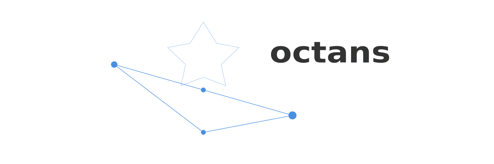

# Octans



> There is no real mythology related to Octans, partially due to its faintness and relative recentness, but mostly because of its extreme southerly latitude.

—[Wikipedia](https://en.wikipedia.org/wiki/Octans)

Octans is a WIP tag-based image management system.

It's essentially my reimplementation of [the Hydrus Network](https://hydrusnetwork.github.io/hydrus/index.html) in C#.
I'm developing it because:

- I think I could make Hydrus much faster by using C# instead of Python
- I think I could design a more maintainable codebase than Hydrus
- Hydrus is lacking features I want and is unlikely to add them
- It'd be fun (always the most important reason)

## Features

- Local and remote image import and management
- Namespaced tag-based organization system
- Support for tag relationships (siblings/parents) [WIP]
- Lua-based extensibility to work with custom sites

## Project structure & getting started

- `Octans.Client`: Blazor-based UI and application server.
- `Octans.Core`: Core business logic and domain models.
- `Octans.Data`: Database context, migrations, and data access.

Run `dotnet test` on the `Octans.Tests` project to run automated tests.

   ```bash
   dotnet run --project Octans.Client
   ```

A Dockerfile is provided for easy containerized setup.

## Tech used

- Blazor for the UI
- EF Core w/ SQLite
- SixLabors.ImageSharp for image processing
- Lua for extensible downloaders

## SBOM

The continuous integration workflow generates a Software Bill of Materials (SBOM) using Anchore's SBOM action. An SPDX document (`sbom.spdx.json`) is produced for each build and uploaded as a workflow artifact to help track project dependencies.

## License

MIT license.
